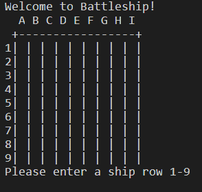
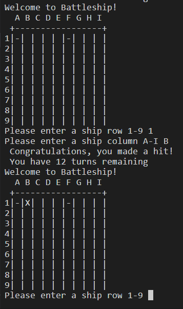
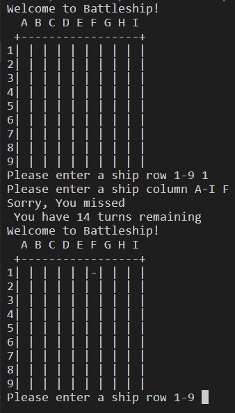
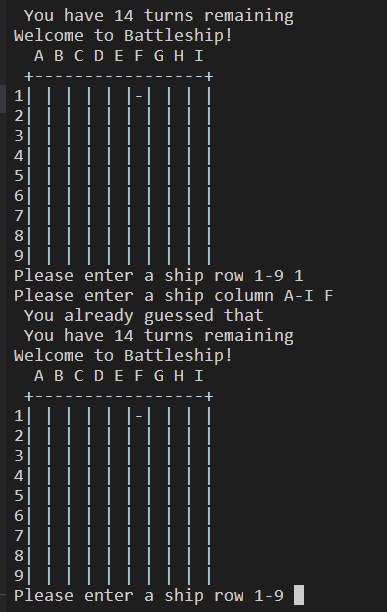
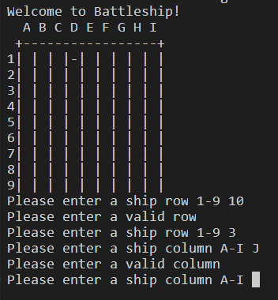
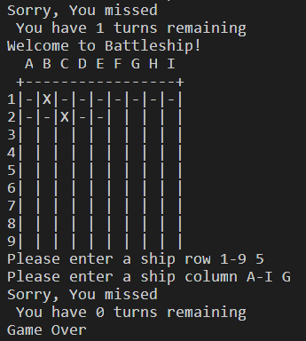
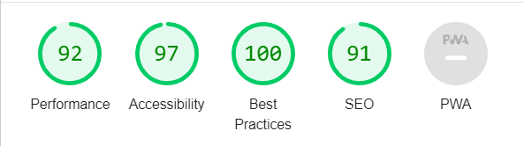

# Battleships

This Battleships is a Python terminal game, that runs on Heroku in a mock terminal provided by Code Institute.
The user tries to find the battleships in 15 turns. Each ship occupies one square on the board.

## How to play
Battleships is based on the classic pen-and-paper game. 
In this version the computer creates a hidden board with five ships and one empty board the player sees. The user then tries to find the ships by guessing a row and a column. Guesses are marked on the board by - . Hits are marked with an X. The game is over when the user has made 15 guesses or found all the ships before the countdown.

## Features
* Ships are randomly placed on a hidden board which the user can not see. 
* Accepts user input
* You cannot enter coordinates outside the grid
* You cannot guess the same location twice
* Turn counts

### Future features
* The user can choose the size of the board
* The computer is part of the game and guesses the ship locations of the player
* The user can choose the ship locations 

## Testing
I manually tested this game by doing the following:
* Run the code through CI Python Linter, with no errors to show
* Tested the game in my local terminal and the Heroku terminal
* Given invalid coordinates and made the same guess twice

## Accessibility

## Deployment
* Create an account and login into Heroku website
* Click "New -> Create new app" button
* Insert your app's name and choose your region, then click the "Create App" button
* In the Settings tab choose "Config vars" section and click "Reveal Config Vars"
* Enter the PORT in the KEY section and 8000 for its value, then click "Add"
* Go to "Buildpacks" section and click "Add buildpack"
* Add first the Python buildpack then the NodeJs
* In the Deploy tab go to "Deployment method" and select Github
* After that go to "App connected to GitHub" and look for your GitHub repository name to link it
* You can now choose to either manually or automatically deploy your app to Heroku
* With automatic deploys enabled, Heroku will build a new version of the app each time a change has been pushed to the repository
* Manual deploys means your app will be updated only when you manually click to deploy it
* When the deploying is finished, a link will be provided to you for accessing your app

## Credits
* w3 schools was used as references to check syntax for coding and for general queries
* Knowledge Mavens youtube tutorial